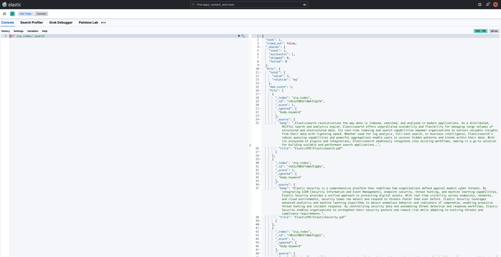

# Zip Indexer

This project uses Quarkus and Camel

The project demonstrates how to index PDF documents within a zip archive into Elastic

## Requirements
- Elastic Cluster
- Elastic Api Key

### Elastic Cluster
- **Local**, you can run elastic on [docker](https://www.elastic.co/guide/en/elasticsearch/reference/current/docker.html)   
The Elasticsearch endpoit will be https://localhost:9200
- **Cloud**, you can start a free trial on [Elastic Cloud](https://cloud.elastic.co/)    
In Elastic Cloud the Elasticsearch endpoint can be found on the **My deployment** page of your deployment:


### Elastic Api Key
You can generate an API key on the Management page under Security.   


## Configure Application
When you have the `endpoint url` and `apy key` you need to put this properties in file [application.properties](src/main/resources/application.properties)   
The [Camel Route](src/main/java/it/mauiroma/indexer/Routes.java) lookup into the directory `/tmp/zipfile` and consume file named `ElasticPDF.zip`, before launch the application you need to copy the file, you can use the provided [script](zipfile/setup.sh) 

## Packaging and running the application

The application can be packaged using:
```shell script
./mvnw package
```
It produces the `quarkus-run.jar` file in the `target/quarkus-app/` directory.
Be aware that it’s not an _über-jar_ as the dependencies are copied into the `target/quarkus-app/lib/` directory.

The application is now runnable using `java -jar target/quarkus-app/quarkus-run.jar`.

If you want to build an _über-jar_, execute the following command:
```shell script
./mvnw package -Dquarkus.package.type=uber-jar
```

The application, packaged as an _über-jar_, is now runnable using `java -jar target/*-runner.jar`.

## Verify Indexed Documents
You can verify the documents on the Management page under `Dev Tools`.
```shell script
GET zip_index/_search
```



## Related Guides

- Camel Core ([guide](https://camel.apache.org/camel-quarkus/latest/reference/extensions/core.html)): Camel core functionality and basic Camel languages: Constant, ExchangeProperty, Header, Ref, Simple and Tokenize
- Elasticsearch Java Client ([guide](https://quarkus.io/guides/elasticsearch)): Connect to an Elasticsearch cluster using the Java client
- Camel Zip File ([guide](https://camel.apache.org/camel-quarkus/latest/reference/extensions/zipfile.html)): Compression and decompress streams using java.util.zip.ZipStream
